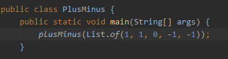
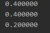
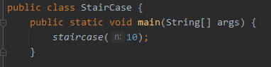
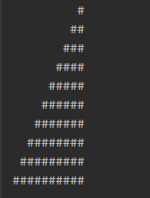

# hacker-rank - desafios resolvidos

1° desafio - Plus Minus: Dividir o total de números negativos, positivos e com valor igual a 0 pelo tamanho do array.
Por exemplo: 
 - [1, 1, -1, 0, -1]
 - Números positivos: 2/5 onde:
   - 2 -> total de números positivos
   - 5 -> tamanho do array

2° desafio - Staircase: Imprimir em ordem crescente (com base em um valor n recebido) uma "escadinha" de hashtags

# Use cases
 

